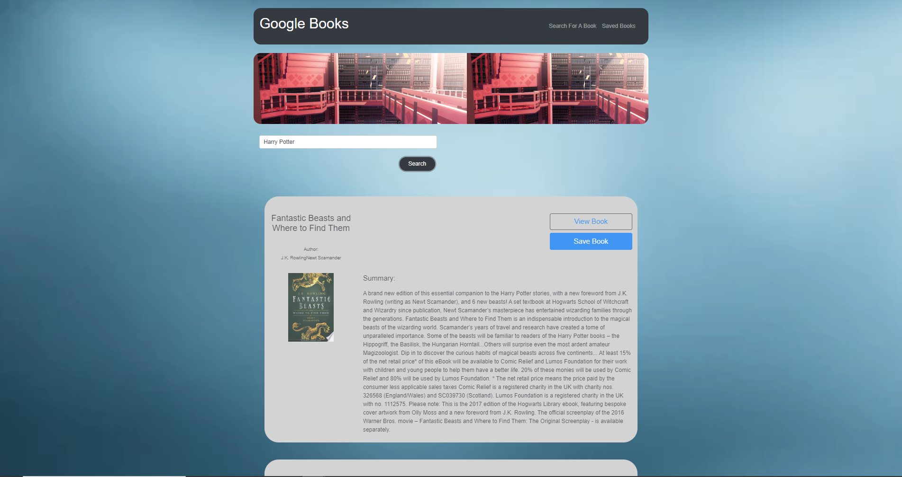

# Google-Books

### Links: 

Github: <br>
https://github.com/bryanjacinto1994/Google-Books

<hr>


## Tools Used:

* Visual Studio Code - Open source code editor for building and debugging web and cloud applications.
* JavaScript - A scripting language that uses curly-bracket syntax, first class functions and object-oriented.
* jQuery - A JavaScript library that simplifys to manipulate HTML DOM.
* Git - Version control system to track changes to source code.
* Github - Hosts respository that can be deployed to GitHub pages.
* NodeJS - A JavaScript runtime built on Chrome's V8 JavaScript engine
<br>

### NPM Packages Used:

* Inquirer
* MySQL
* Cli-Table


<hr>


<br>
 
 <br> <br> <hr> <br> <br>
 <br> <br>

<hr>


## Summary


<hr>


## Code Snippet

.js : <br>
* 
<br> 

```javascript


    
```


## Author Links
Linkedin:<br>
https://www.linkedin.com/in/bryan-jacinto-100438aa/

Github:<br>
https://github.com/bryanjacinto1994
